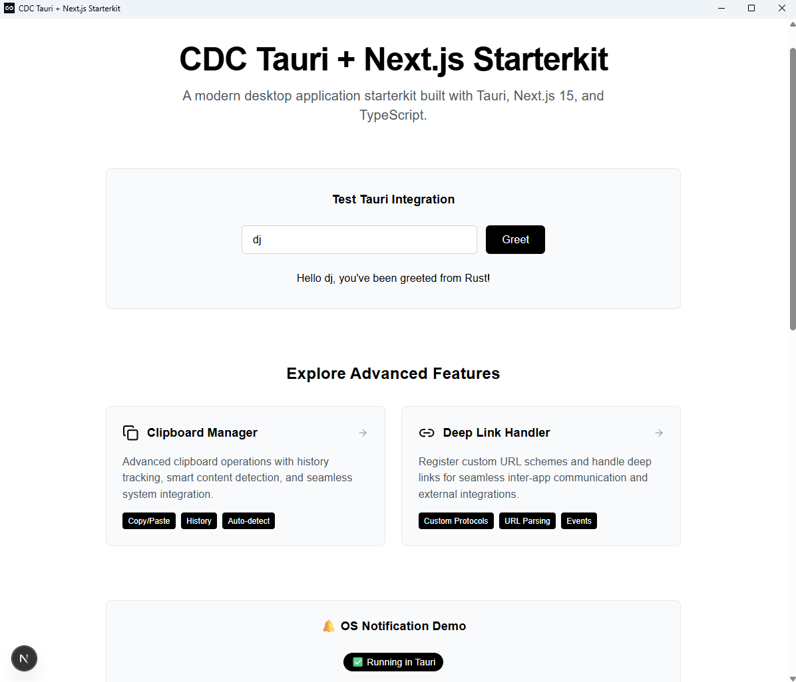

# 🚀 Tauri + Next.js 15+ Starterkit

A modern, cross-platform desktop application starter kit built with **Tauri**, **Next.js 15+**, **TypeScript**, and **Tailwind CSS**. Features native desktop integration including system tray and native menus.

## ✨ Features

### Core Framework
- 🖥️ **Cross-platform Desktop App** - Windows, macOS, and Linux support
- 🦀 **Rust Backend** - High-performance Tauri backend
- ⚛️ **Next.js 15+** - Latest Next.js with React 19 and *App Router*
- 🎨 **Tailwind CSS** - Modern utility-first styling framework
- 🔷 **TypeScript** - Full type safety across frontend and backend
- 🔄 **Hot Reload** - Fast development experience
- 📦 **Static Export** - Optimized for desktop distribution

### 🧩 Modular Features (Optional)
- 🔔 **Notifications** - Native system notifications with permission handling
- 🔗 **Deep Links** - Custom protocol handling for deep linking
- 📋 **Clipboard Manager** - Advanced clipboard with history and image support
- 🖥️ **System Tray** - Minimize to system tray with context menu

> **💡 All features are modular!** Enable only what you need to keep your app lightweight. See [Feature Configuration Guide](FEATURES.md) for details.

## 🖼️ Screenshot



## 🏗️ Project Structure

```
cdc-tauri-starterkit/
├── public/                   # Static assets
│   └── screenshot.png        # Application screenshot
├── scripts/                  # Build and utility scripts
├── src/                      # Next.js 15+ frontend
│   ├── app/                  # App Router
│   │   ├── layout.tsx        # Root layout
│   │   ├── page.tsx          # Home page
│   │   └── globals.css       # Global styles
│   ├── components/           # React components
│   │   └── TauriDemo.tsx     # Tauri integration demo
│   └── lib/                  # Utilities and helpers
│       └── tauri.ts          # Tauri API helpers
├── src-tauri/                # Rust backend
│   ├── src/
│   │   ├── main.rs          # Main application
│   │   ├── commands.rs      # Tauri commands
│   │   ├── menu.rs          # Native menus
│   │   ├── tray.rs          # System tray
│   │   └── lib.rs           # Library exports
│   ├── gen/                 # Generated schemas
│   ├── icons/               # App and tray icons
│   ├── build.rs             # Build script
│   ├── Cargo.toml           # Rust dependencies
│   ├── Cargo.lock           # Rust dependency lock
│   └── tauri.conf.json      # Tauri configuration
├── IMPLEMENTATION_PLAN.md    # Development roadmap
├── SETUP_STATUS.md          # Setup progress tracking
├── TAURI_BUILD_SETUP.md     # Build configuration guide
├── next-env.d.ts            # Next.js TypeScript definitions
├── next.config.js           # Next.js configuration
├── package.json             # Node.js dependencies
├── package-lock.json        # Node.js dependency lock
├── postcss.config.js        # PostCSS configuration
├── tailwind.config.js       # Tailwind configuration
└── tsconfig.json            # TypeScript configuration
```

## 🚀 Quick Start

### Prerequisites

- **Node.js** (v18 or higher)
- **Rust** (latest stable)
- **System dependencies** for Tauri development

#### Install Rust

**Windows:**
1. Download and run the installer from [rustup.rs](https://rustup.rs/)
2. Or use PowerShell:
   ```powershell
   Invoke-WebRequest -Uri https://win.rustup.rs/x86_64 -OutFile rustup-init.exe
   .\rustup-init.exe
   ```
3. Restart your terminal after installation

**macOS/Linux:**
```bash
curl --proto '=https' --tlsv1.2 -sSf https://sh.rustup.rs | sh
```

#### Install Tauri CLI
```bash
npm install -g @tauri-apps/cli@next
```

### Installation

1. **Clone the repository**
   ```bash
   git clone <your-repo-url>
   cd cdc-tauri-starterkit
   ```

2. **Install dependencies**
   ```bash
   npm install
   ```

3. **Start development server**
   ```bash
   npm run tauri:dev
   ```

4. **Choose features (optional)**
   ```bash
   # Run with specific features
   npm run tauri:dev -- --features clipboard,notifications
   
   # Or build with features
   npm run tauri:build -- --features deep-links
   ```

**Windows Notes:**
- Use **PowerShell** or **Command Prompt** as Administrator for best results
- If using **Git Bash**, some commands may need to be run in PowerShell
- Ensure **Windows Defender** or antivirus software isn't blocking Rust compilation
- The first build may take longer as Rust compiles dependencies

## 📜 Available Scripts

- `npm run tauri:dev` - Start Tauri development mode with no optional features
- `npm run tauri:dev:feat` - Start Tauri development mode with all features enabled
- `npm run tauri:build` - Build Tauri application (append `-- --features feature1,feature2` to enable features)
- `npm run tauri:info` - Show Tauri environment information
- `npm run dev` - Start Next.js development server
- `npm run build` - Build Next.js for production

### Feature Examples
- `npm run tauri:dev -- --features clipboard` - Run with clipboard feature only
- `npm run tauri:dev -- --features clipboard,notifications` - Run with clipboard and notifications
- `npm run tauri:build -- --features deep-links` - Build with deep-links feature only

## 🖥️ Native Features

### System Tray
- **Left Click**: Toggle window visibility
- **Double Click**: Show and focus window
- **Right Click**: Open context menu with options:
  - Show Window
  - Hide Window
  - About
  - Settings
  - Quit

### Native Menu Bar
- **File**: New, Open, Save, Save As, Quit
- **Edit**: Undo, Redo, Cut, Copy, Paste, Select All
- **View**: Reload, Toggle DevTools, Zoom controls
- **Window**: Minimize, Hide, Close
- **Help**: About, Documentation

### Window Behavior
- **Close Button**: Hides window instead of closing (stays in tray)
- **Minimize**: Can minimize to tray or taskbar
- **Focus**: Proper window focusing and activation

## 🧩 Choose Features at Build Time

This starter kit is **feature-neutral by design**. All optional features are disabled by default, and you choose which features to enable when running or building your application.

### How to Choose Features

**Development with Features:**
```bash
# Run with specific features
npm run tauri:dev -- --features clipboard,notifications

# Run with all features (equivalent to the old "full" preset)
npm run tauri:dev:feat

# Run with no features (minimal build)
npm run tauri:dev
```

**Building with Features:**
```bash
# Build with specific features
npm run tauri:build -- --features clipboard,notifications

# Build with no features (minimal build)
npm run tauri:build
```

**Advanced Cargo Usage:**
```bash
# Use cargo directly for more control
cargo tauri dev --features clipboard,deep-links
cargo tauri build --features notifications
```

### Available Features

| Feature | Description | Bundle Impact | Dependencies |
|---------|-------------|---------------|--------------|
| `notifications` | Native system notifications | ~200KB | tauri-plugin-notification |
| `deep-links` | Custom protocol handling | ~150KB | tauri-plugin-deep-link |
| `clipboard` | Advanced clipboard manager | ~800KB | tauri-plugin-clipboard-manager + image processing |
| `system-tray` | System tray integration | ~50KB | Built into Tauri |

### Common Feature Combinations

```bash
# Full build - All features (equivalent to old "full" preset)
npm run tauri:dev -- --features notifications,deep-links,clipboard,system-tray

# Productivity app - Clipboard + notifications
npm run tauri:dev -- --features clipboard,notifications,system-tray

# Web integration app - Deep links + notifications
npm run tauri:dev -- --features deep-links,notifications

# Minimal app - No optional features (default)
npm run tauri:dev
```

**Build Examples:**
```bash
# Production builds with specific features
npm run tauri:build -- --features clipboard,notifications
npm run tauri:build -- --features deep-links
npm run tauri:build  # minimal build
```

**📖 For detailed configuration guide, see [FEATURES.md](FEATURES.md)**

## 🔧 Configuration

### Tauri Configuration
Edit `src-tauri/tauri.conf.json` to customize:
- Window properties (size, position, decorations)
- System tray settings
- Security policies
- Bundle configuration

### Next.js Configuration
Edit `next.config.js` to customize:
- Static export settings
- Asset handling
- Build optimization

### Styling
- **Global styles**: `src/app/globals.css`
- **Tailwind config**: `tailwind.config.js`
- **Component styles**: Use Tailwind utility classes

## 🛠️ Development

### Adding Tauri Commands
1. Add command function in `src-tauri/src/commands.rs`
2. Register command in `src-tauri/src/main.rs`
3. Add TypeScript types in `src/lib/tauri.ts`
4. Use command in React components

### Adding Menu Items
1. Update menu structure in `src-tauri/src/menu.rs`
2. Handle menu events in the same file
3. Register menu in `src-tauri/src/main.rs`

### Adding Tray Features
1. Update tray menu in `src-tauri/src/tray.rs`
2. Handle tray events in the same file
3. Configure tray in `src-tauri/tauri.conf.json`

## 📦 Building for Production

### Development Build
```bash
npm run tauri:dev
```

### Production Build
```bash
npm run tauri:build
```

The built application will be available in `src-tauri/target/release/bundle/`.

### Distribution
- **Windows**: `.msi` installer and `.exe` executable
- **macOS**: `.dmg` disk image and `.app` bundle
- **Linux**: `.deb`, `.rpm`, and `.AppImage` packages

## 🔍 Troubleshooting

### Common Issues

1. **Tauri CLI not found**
   ```bash
   npm install -g @tauri-apps/cli@next
   ```

2. **Rust compilation errors**
   ```bash
   rustup update
   ```

3. **Node.js version issues**
   - Ensure Node.js v18+ is installed
   - Use `nvm` to manage Node.js versions

4. **TypeScript errors**
   - Install dependencies: `npm install`
   - Restart TypeScript server in your editor

5. **Windows-specific issues**
   
   **"Microsoft Visual C++ 14.0 is required" error:**
   ```powershell
   # Install Visual Studio Build Tools
   winget install Microsoft.VisualStudio.2022.BuildTools
   ```
   
   **"link.exe not found" error:**
   - Ensure Visual Studio Build Tools are installed with C++ workload
   - Restart your terminal after installation
   - Verify installation: `where link.exe`
   
   **PowerShell execution policy errors:**
   ```powershell
   Set-ExecutionPolicy -ExecutionPolicy RemoteSigned -Scope CurrentUser
   ```
   
   **Path issues with Rust/Cargo:**
   - Restart your terminal or IDE after Rust installation
   - Manually add to PATH if needed: `%USERPROFILE%\.cargo\bin`
   
   **WebView2 runtime missing:**
   - Download and install [Microsoft Edge WebView2](https://developer.microsoft.com/en-us/microsoft-edge/webview2/)
   - Or install via command: `winget install Microsoft.EdgeWebView2Runtime`

### System Dependencies

#### Windows
**Prerequisites:**
- **Visual Studio Build Tools** or **Visual Studio Community** with C++ development tools
- **Windows 10 SDK** (usually included with Visual Studio)

**Option 1: Visual Studio Installer**
1. Download [Visual Studio Community](https://visualstudio.microsoft.com/vs/community/) (free)
2. During installation, select "Desktop development with C++"
3. Ensure "Windows 10/11 SDK" is included

**Option 2: Build Tools Only**
1. Download [Visual Studio Build Tools](https://visualstudio.microsoft.com/downloads/#build-tools-for-visual-studio-2022)
2. Install with C++ build tools and Windows SDK

###### Desktop & Mobile Section:
- ✅ **Desktop development with C++**
  - This provides MSVC, Clang, CMake, and MSBuild tools
  - **This is the main one you need for Tauri!**

##### Individual Components (Click "Individual components" tab):
After selecting the C++ workload, also ensure these are selected:
- ✅ **Windows 11 SDK** (latest version available)
- ✅ **MSVC v143 - VS 2022 C++ x64/x86 build tools**
- ✅ **CMake tools for Visual Studio**


**Option 3: Using Chocolatey**
```powershell
# Install Chocolatey first if not installed
Set-ExecutionPolicy Bypass -Scope Process -Force; [System.Net.ServicePointManager]::SecurityProtocol = [System.Net.ServicePointManager]::SecurityProtocol -bor 3072; iex ((New-Object System.Net.WebClient).DownloadString('https://community.chocolatey.org/install.ps1'))

# Install build tools
choco install visualstudio2022buildtools --package-parameters "--add Microsoft.VisualStudio.Workload.VCTools"
```

#### Ubuntu/Debian
```bash
sudo apt update
sudo apt install libwebkit2gtk-4.0-dev build-essential curl wget libssl-dev libgtk-3-dev libayatana-appindicator3-dev librsvg2-dev
```

#### Fedora
```bash
sudo dnf groupinstall "C Development Tools and Libraries"
sudo dnf install webkit2gtk3-devel openssl-devel curl wget libappindicator-gtk3-devel librsvg2-devel
```

#### macOS
```bash
xcode-select --install
```

## 🤝 Contributing

1. Fork the repository
2. Create a feature branch
3. Make your changes
4. Test thoroughly
5. Submit a pull request

## 📄 License

This project is licensed under the MIT License - see the [LICENSE](LICENSE) file for details.

## 🙏 Acknowledgments

- [Tauri](https://tauri.app/) - Desktop app framework
- [Next.js](https://nextjs.org/) - React framework
- [Tailwind CSS](https://tailwindcss.com/) - CSS framework
- [TypeScript](https://www.typescriptlang.org/) - Type safety

---

**Happy coding!** 🎉

For more information, visit the [Tauri documentation](https://tauri.app/v1/guides/) and [Next.js documentation](https://nextjs.org/docs).